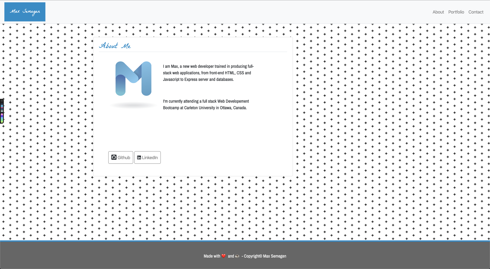

# Portfolio

   

See the deployed website here:

https://maxsem4.github.io/portfolio/

## Description

This project is a website which displays some information about me, as well as links to my GitHub profile, my LinkedIn profile. It also displays some projects which I feel show off my web development abilities particularly well.

The project is comprised of 3 separate files, and the navbar at the top of the screen allows for navigation among the different files.

## Author

👤 **Max Semegen**

## 📝 License

Copyright © 2020 [Max Semegen](https://github.com/Maxsem4). 
This project is 

\_This README was generated with ❤️ by Max Semegen
